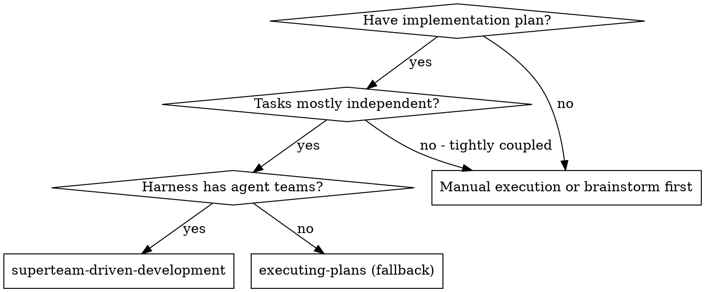

# Superteam-Driven Development

You are the lead (PM). Execute the plan as a task graph worked by one fresh
implementer IC per task, on its own branch, in a worktree only when its tier
says so, a task review (spec compliance + code quality) after each when the
sizing seated a reviewer, and a broad whole-branch review at the end. The
lead implements nothing, not even a one-line fix: it sizes, briefs, reviews,
rules, and merges (an integrator merges only when worktree
merges need serialising). Read "## Modes" first — team mode puts
the graph on the shared task list and lets role teammates claim their own
work; fallback mode dispatches the same roles as subagents.

**Why ICs:** You delegate tasks to specialized agents with isolated context. By precisely crafting their instructions and context, you ensure they stay focused and succeed at their task. They should never receive your session's context or history — you construct exactly what they need. This also preserves your own context for coordination work.

**Core principle:** Fresh IC per task + task review (spec + quality) + broad final review = high quality, fast iteration

**Narration:** between tool calls, narrate at most one short line — the
ledger and the tool results carry the record.

**Continuous execution:** Do not pause to check in with your human partner between tasks. Execute all tasks from the plan without stopping. The only reasons to stop are the four named below, or all tasks complete. "Should I continue?" prompts and progress summaries waste their time — they asked you to execute the plan, so execute it.

**Rulings, not stalls.** A running plan does not wait on a human. Conflicts,
ambiguities, plan defects, a cap you would have asked to exceed — decide
them. The spec is the binding authority, the plan is its argument, and your
judgment settles what neither answers. Record every decision in the ledger as
`Ruling: <what you decided> — <why> — <what it costs if wrong>`, and keep
going. A wrong ruling costs rework your human partner can see and undo; a
session parked on a question costs their whole day and buys nothing.

Four things stop you, and only these: an irreversible or destructive
operation; a security-sensitive action; a side effect outside this worktree
that norms say you ask about first (a merge, a push to a shared branch, a
publish); and a plan so broken that every path forward is a guess. For those,
stop and ask.

## When to Use



**What this adds over superteam:executing-plans, the fallback for harnesses
without agent teams:**
- One seat per role, all in this session (no context switch)
- Fresh IC per task, each on its own branch, in a worktree only when its
  tier says so (a fresh context per IC; file collisions are refused by the
  task-created-check hook)
- Review after each task (spec compliance + code quality) when the sizing
  seated a reviewer, broad review at the end
- Faster iteration (no human-in-loop between tasks)

## Isolation tiers

Every task carries an `**Isolation:**` line chosen at intake.
**trunk** (the default, and what a missing line means): one writing seat, the
only thing writing, no review seat before landing; it commits straight on
`<base>` in the lead's own checkout and the lead reads the commits after they
land, reverting a bad one. **branch**: a review seat must sit between the work
and trunk, or a second seat is live without both writing at once; one writing
seat at a time on `task-N` in the lead's own checkout, the lead merges — a
branch for a lone writer with no review seat is a merge commit for nothing.
**worktree**: two or more writing seats must write in this
repo at once; a plain `git worktree add`, nothing provisioned.
**provisioned**: the worktree tier plus the repo's own provisioning script,
only when a second running dev server or database is required. `<base>` is
trunk, or the lane the plan header names in `**Integration:**`. The table,
triggers and evidence are in [docs/isolation-tiers.md](../../docs/isolation-tiers.md).

A plan escalates a task off trunk — to branch when a second seat goes live,
to worktree whenever two or more writing tasks are unblocked at the same
time. The lead records in the
ledger, per task, the maximum number of concurrent writers, any
dirty-checkout collision, and wall-clock time from claim to merge, so the
next run of six or more tasks can be judged against the 7.3.0 baseline.

Before anything is dispatched, the lead sizes the brief on five dimensions: how many files it touches; whether anything else is writing in the repo; the cost of a mistake; whether there is a design choice to make; how many independent pieces it has. The size sets which seats sit. It is a scale the lead reads for every brief, never a category the brief matches, and the lead's own hands are not on it: the lead does not implement, not even a one-line fix — a spawn costs seconds and keeps the lead's context for leading. A request that arrives straight from your human partner is sized and delegated exactly like a brief from above.

1. **One IC.** The smallest size: one implementer or writer on trunk, even for a one-line fix; the lead reads its commits after they land.
2. **Add the seat that answers the risk.** A design choice seats a skeptic before building; a costly failure seats a reviewer after.
3. **One IC per independent piece, at once.** Several independent pieces get a writing seat each, plus whatever step 2 seats each piece's own risk calls for.

Examples are illustrations, never the rule: a copy change is usually one IC and nothing more, but a copy change to a legal notice has a costly failure and gets a reviewer; a one-file schema migration is one task, but it has a design choice and a costly failure, so it gets both seats; three docs pages with nothing in common are three writers at once. The lead states the size it chose and the dimensions that drove it in its report and in the ledger, so the next brief can be calibrated against it.

The reviewer claims a branch-tier review only after the implement task is
complete and judges commits — git diff <base>..task-N — never the working
tree. While a branch-tier task is in progress no seat, the lead included,
switches branch in the checkout; the guard has no arm for this, the rule and
the escalation above are the containment.

## Two kinds of IC

The roster (`agents/*.md`, invoked as `superteam:<name>`) has two shapes.
Seats that write: **implementer** (code, TDD, commits) and **writer** (prose
deliverables — docs, drafts — the same seat, no TDD). Read-only seats with no
isolation: **reviewer** (every review seat in this skill), **researcher**
(investigation that returns a conclusion), **skeptic** (pre-build objections;
never sees a diff), and **integrator** (the one seat that mutates your
checkout: merges, cleanup, version bumps — one at a time). Five rules bind
every seat:

1. **Name the agent.** Every `Agent` call uses `subagent_type: "superteam:<role>"`; the harness-generic agent name appears only in the other-harness fallback comment.
2. **The agent carries the model.** Each agent file sets `model` and `effort`; a call overrides `model` only with a reason from Model Selection written next to it.
3. **Tools follow the role.** Read-only roles carry `disallowedTools`; the skill never widens them.
4. **One role per seat.** A reviewer does not fix; a researcher does not edit; an implementer does not merge.
5. **One report per turn.** No IC ends a turn while a command it started is still running; tests run in the foreground (or are waited on) and the result arrives in one report — an early "waiting" reply reaches you as repeated idle notices.

The roster is a merge-roles list — a new agent needs a written reason it
cannot be a seat of an existing one.

**Implementer and writer — the writing seat.** In team mode this seat is a
teammate spawned once into the role pool with **no `isolation`** (see
"## Role pool"); how it isolates after it claims follows the task's
`Isolation:` line (see "## Isolation tiers").

*Trunk tier.* The seat claims `Task N: implement` (or `[writer]`) from the
shared list, stays on `<base>` in the lead's checkout — no branch, no
worktree — commits there, and reports; there is nothing to merge. While a
trunk-tier task is `in_progress` no one, the lead included, changes branch in
that checkout.

*Branch tier.* The seat claims `Task N: implement` (or `[writer]`) from the
shared list, runs `git switch -c <Branch> <Lane>` in the lead's checkout,
commits on that branch, stays on it, and reports; the lead merges. While a
branch-tier task is `in_progress` no one, the lead included, changes branch
in that checkout.

*Worktree and provisioned tiers.* The seat claims, runs `EnterWorktree` with
the description's `Worktree:` name, and makes `git merge <lane>` the first
command inside it. It commits on its own branch and reports; the integrator
merges, or the lead does when the plan has no integrator seat. Split panes
are required when any task in the plan is worktree tier: an in-process
teammate shares your session's process cwd, so its `EnterWorktree` moves you
and every other teammate with it — a dogfood run landed three implementers'
edits in one worktree that way.

Fallback mode dispatches the same seat as a named subagent, carrying
`isolation: "worktree"` on the call when the task's tier calls for one; that
call shape appears once, at "1. Dispatch the implementer — Fallback mode".

A worktree seat works in `.claude/worktrees/<name>` on branch
`worktree-<name>`, branched from the repo default branch, with git guarded
so it cannot touch your checkout. Its final report names the branch, the
commit, and the diff stat. When the task depends on tasks you have already
merged, `git merge <lane>` (your lane branch) is what starts it from the
merged prior work — say so in the brief. Never put two writing seats on the
same files at once.

A worktree seat never receives an absolute path into your checkout:
`.superteam/` is gitignored and absent from the worktree, and the guard
refuses the shared-checkout path. Anything such an IC must read by path is
either committed before the worktree is created or copied into the
worktree by you. This is why the brief inlines the task text and
global constraints instead of pointing at a brief file, and why
the IC's report lives at a path relative to its own cwd. A branch-tier seat
works in your checkout and reads the plan's committed path directly.

**Reviewer** — a named agent with NO `isolation`. Review is read-only, so it
needs no worktree; when agent teams are enabled it runs as a true teammate
in your working directory, otherwise as a named subagent — the call is the
same either way:

```
Agent:
  name: "task-3-review"
  model: [omit to take the agent's default; override only with a Model Selection reason written here]
  subagent_type: "superteam:reviewer"  # general-purpose if the plugin agent is not loaded
  description: "Review Task 3 (spec + quality)"
  prompt: [task-reviewer-prompt.md, filled — includes the review-package path]
```

A reviewer may `SendMessage` the implementer by name to ask what a change
was for; it never edits, and it never fixes. Both kinds report back to you:
implementer results arrive as completion notifications, reviewer verdicts
as their final message.

**Integrator** — `subagent_type: "superteam:integrator"`, no `isolation`,
dispatched only when the graph has merge tasks — worktree-tier tasks in a
plan with three or more of them; otherwise the lead merges in "5. Complete
the task". When it is dispatched, it goes one at a time in your checkout
after a task's seats are clean ("5. Complete the task") and again at Finish. It gets the branch to merge, the lane, the test
command, and whether to bump; it reports the merge commit and the suite
result. You never merge inline when the integrator is available.

**Other harnesses:** without `Agent`/`SendMessage`/worktree isolation, the
older subagent dispatch shape still applies — dispatch each prompt template
through your platform's subagent tool and let implementers commit on the
lane branch directly. Platform mappings live in
[../using-superteam/references/](../using-superteam/references/).

## The Process

The per-task review seats, the fix-round loop and the final two-axis review
run only when the sizing seated a reviewer for that task or plan (a costly
failure, or the brief asks — see "## Isolation tiers"). Otherwise the
implementer's report plus the suite is the evidence and the merge follows
the report.

```dot
digraph process {
    rankdir=TB;

    subgraph cluster_per_task {
        label="Per Task";
        "Lead creates Task N graph: implement, review, merge" [shape=box];
        "implementer self-claims, isolates per tier (trunk: stays on <base>; branch: git switch -c; worktree: EnterWorktree + git merge lane)" [shape=box];
        "Implementer asks questions?" [shape=diamond];
        "Answer questions, provide context" [shape=box];
        "Implementer implements, tests, commits, self-reviews, appends Verified: line" [shape=box];
        "Sizing seated a reviewer?" [shape=diamond];
        "reviewer self-claims, reads the branch diff, verdicts spec and quality" [shape=box];
        "Spec ✅ and quality approved?" [shape=diamond];
        "Finding conflicts with plan text?" [shape=diamond];
        "Rule on the conflict, ledger the ruling" [shape=box];
        "Lead creates fix round R of 5: Task N fix R, Task N review R" [shape=box];
        "implementer self-claims the fix, fixes in the same worktree branch" [shape=box];
        "reviewer self-claims the re-review, verdicts each finding" [shape=box];
        "All findings addressed?" [shape=diamond];
        "R = 5?" [shape=diamond];
        "Adjudicate each open finding" [shape=box];
        "Any load-bearing finding?" [shape=diamond];
        "Rule and continue; stop only if every path forward is a guess" [shape=box];
        "Park findings in ledger with rulings" [shape=box];
        "lead (branch tier) or integrator (worktree tier) merges the branch into <base>; trunk tier: nothing to merge" [shape=box];
    }

    "Setup: lane branch, workspace, pre-approval, task graph, role pool, state the mode" [shape=box];
    "More tasks remain?" [shape=diamond];
    "Dispatch two-axis final review (superteam:requesting-code-review)" [shape=box];
    "Final findings? ONE fix dispatch, one scoped re-review, adjudicate residuals" [shape=box];
    "Final review clean: delete this plan's workspace" [shape=box];
    "Use superteam:finishing-a-development-branch" [shape=box style=filled fillcolor=lightgreen];

    "Setup: lane branch, workspace, pre-approval, task graph, role pool, state the mode" -> "Lead creates Task N graph: implement, review, merge";
    "Lead creates Task N graph: implement, review, merge" -> "implementer self-claims, isolates per tier (trunk: stays on <base>; branch: git switch -c; worktree: EnterWorktree + git merge lane)";
    "implementer self-claims, isolates per tier (trunk: stays on <base>; branch: git switch -c; worktree: EnterWorktree + git merge lane)" -> "Implementer asks questions?";
    "Implementer asks questions?" -> "Answer questions, provide context" [label="yes"];
    "Answer questions, provide context" -> "Implementer implements, tests, commits, self-reviews, appends Verified: line";
    "Implementer asks questions?" -> "Implementer implements, tests, commits, self-reviews, appends Verified: line" [label="no"];
    "Implementer implements, tests, commits, self-reviews, appends Verified: line" -> "Sizing seated a reviewer?";
    "Sizing seated a reviewer?" -> "reviewer self-claims, reads the branch diff, verdicts spec and quality" [label="yes"];
    "Sizing seated a reviewer?" -> "lead (branch tier) or integrator (worktree tier) merges the branch into <base>; trunk tier: nothing to merge" [label="no - report + suite is the gate"];
    "reviewer self-claims, reads the branch diff, verdicts spec and quality" -> "Spec ✅ and quality approved?";
    "Spec ✅ and quality approved?" -> "lead (branch tier) or integrator (worktree tier) merges the branch into <base>; trunk tier: nothing to merge" [label="yes"];
    "Spec ✅ and quality approved?" -> "Finding conflicts with plan text?" [label="no"];
    "Finding conflicts with plan text?" -> "Rule on the conflict, ledger the ruling" [label="yes"];
    "Rule on the conflict, ledger the ruling" -> "Lead creates fix round R of 5: Task N fix R, Task N review R";
    "Finding conflicts with plan text?" -> "Lead creates fix round R of 5: Task N fix R, Task N review R" [label="no"];
    "Lead creates fix round R of 5: Task N fix R, Task N review R" -> "implementer self-claims the fix, fixes in the same worktree branch";
    "implementer self-claims the fix, fixes in the same worktree branch" -> "reviewer self-claims the re-review, verdicts each finding";
    "reviewer self-claims the re-review, verdicts each finding" -> "All findings addressed?";
    "All findings addressed?" -> "lead (branch tier) or integrator (worktree tier) merges the branch into <base>; trunk tier: nothing to merge" [label="yes"];
    "All findings addressed?" -> "R = 5?" [label="no"];
    "R = 5?" -> "Lead creates fix round R of 5: Task N fix R, Task N review R" [label="no - next round"];
    "R = 5?" -> "Adjudicate each open finding" [label="yes - breaker trips"];
    "Adjudicate each open finding" -> "Any load-bearing finding?";
    "Any load-bearing finding?" -> "Rule and continue; stop only if every path forward is a guess" [label="yes"];
    "Any load-bearing finding?" -> "Park findings in ledger with rulings" [label="no"];
    "Park findings in ledger with rulings" -> "lead (branch tier) or integrator (worktree tier) merges the branch into <base>; trunk tier: nothing to merge";
    "lead (branch tier) or integrator (worktree tier) merges the branch into <base>; trunk tier: nothing to merge" -> "More tasks remain?";
    "More tasks remain?" -> "Lead creates Task N graph: implement, review, merge" [label="yes"];
    "More tasks remain?" -> "Dispatch two-axis final review (superteam:requesting-code-review)" [label="no"];
    "Dispatch two-axis final review (superteam:requesting-code-review)" -> "Final findings? ONE fix dispatch, one scoped re-review, adjudicate residuals";
    "Final findings? ONE fix dispatch, one scoped re-review, adjudicate residuals" -> "Final review clean: delete this plan's workspace";
    "Final review clean: delete this plan's workspace" -> "Use superteam:finishing-a-development-branch";
}
```



## Modes

**Team mode** is on when all hold: `TaskCreate` is in your tool list
(`CLAUDE_CODE_ENABLE_TODO_TOOLS=1` on the opt-in model families), agent
teams are on (`CLAUDE_CODE_EXPERIMENTAL_AGENT_TEAMS=1`), and the session is
interactive (`claude -p` never spawns teammates). State the mode once at
Setup. Anything else is **fallback mode** = 6.10.0 behaviour: worktree
subagents, you claim and complete tasks or keep the plan-file ledger, no
teammates, no hooks fire on subagents. Other harnesses are always fallback.

Team mode requires **split-pane teammates** whenever a task is worktree
tier — `teammateMode: "tmux"` in this repo's `.claude/settings.local.json`,
or `--teammate-mode tmux` at launch — because that writing seat enters a
worktree (see "## Two kinds of IC"). In-process teammates are only for roles that never enter one:
reviewer, integrator, researcher, skeptic. If split panes are unavailable,
run the implement and write tasks in fallback mode.

## Setup

The integration branch — `<base>` — is trunk, unless the plan header says
`**Integration:** lane/<name>`; create the lane only then (via
superteam:using-git-worktrees when the lead itself needs isolation,
otherwise `git switch -c`). Branch-tier seats branch from `<base>` in the
lead's checkout. Worktree seats branch from the repo default branch —
`isolation: "worktree"` and `EnterWorktree` both do — and catch up with
`git merge <base>` as their first step. Never start implementation on a
main/master branch without your human partner's explicit consent; a
branch-tier task branch is not main, and a trunk-tier seat commits on
`<base>` because the plan chose it — that is the consent.

Conversation memory does not survive compaction. In real sessions,
controllers that lost their place have re-dispatched entire completed task
sequences — the single most expensive failure observed. Track progress in
a ledger file, not only in todos.

- Each plan owns a workspace: at skill start, run this skill's
  `scripts/sdd-workspace PLAN_FILE` — it prints the plan's git-ignored
  directory, `.superteam/sdd/<plan-basename>/` under the repo root, home to
  every artifact for THIS plan in your own checkout: ledger, review
  packages, and any file-mode brief you generate for a reviewer. Another
  plan's directory is never yours to read or write. A worktree-tier
  implementer never receives a path into this directory (see "Two kinds of IC" above)
  — it does not exist inside the worktree.
- Resolve the standards files once per plan: `scripts/task-brief` does it on
  its first run and caches the list at `<workspace>/standards` — every
  `CONTRIBUTING.md`, `CODING_STANDARDS.md`, `CLAUDE.md`, `AGENTS.md` at the
  repo root, plus any path on the plan's `**Standards:**` line. The
  `Standards:` line in each implement and review-standards description is
  that result, so every task of one plan is judged against the same rules.
- Check for this plan's ledger at `<workspace>/progress.md`. If its first
  line names your plan file, tasks with a `Task <N>: complete` line are DONE
  — do not re-dispatch them; resume at the first task without one. A task
  whose last line is a fix round is mid-loop: resume the loop at the next
  round. A ledger whose first line names a different plan file — or a stray
  ledger at the old flat path `.superteam/sdd/progress.md` — is another
  plan's progress: leave it in place and start your own, fresh.
- Create the ledger with its identity as the first line:
  `# SDD ledger — plan: <plan file path>`.
- Per task, the ledger records wall-clock time from claim to merge, the
  maximum number of writing seats active at once, and any dirty-checkout
  collision (a seat finding uncommitted changes it did not make) — the
  measurement the Escalation paragraph promises. Its per-task line also
  records `tier`, `size: one IC | +skeptic | +reviewer | per
  piece` and the dimensions that drove it.
- The ledger is your recovery map: the commits it names exist in git even
  when your context no longer remembers creating them. After compaction,
  trust the ledger and `git log` over your own recollection.
- `git clean -fdx` will destroy the workspace (it's git-ignored scratch); if
  that happens, recover from `git log`.
- The status bookkeeping above (`Task <N>: complete` lines) belongs to
  fallback mode. State which mode you are in before Task 1.

**Rulings, both modes:** preflight conflicts, parked findings and breaker
adjudications always go in the plan-file ledger at `<workspace>/progress.md`.
They are spec-level decisions, not status, and the shared task list has no
field for them.

Read the plan once, note its context and Global Constraints, and create a
todo per task. If the plan names a Spec, read that too: the spec is the
authority the plan argues from, and conflicts inside the plan resolve
against it. A plan with no reachable spec gets a ledger note saying so —
rulings made without one are provisional.

Before dispatching Task 1, scan the plan once for conflicts, writing down
what you checked as you check it:

- tasks that contradict each other or the plan's Global Constraints
- anything the plan explicitly mandates that the review rubric treats as a
  defect (a test that asserts nothing, verbatim duplication of a logic block)

The scan's output is a table, not a verdict. One row for every pair of tasks
that share a file or an interface: the two tasks, what one produces against
what the other consumes, and what you found. One row for every task: whether
its own text agrees with itself — the tests it specifies against the code it
specifies, the files it creates against the files it later touches. "The scan
is clean" without those rows is not a scan you ran.

The scan is your own conflict table, not a seat: `superteam:skeptic` is
dispatched from superteam:writing-plans under its own sizing, never from this
skill.

Write the table to the ledger. Rule on everything you find before execution
begins — each finding against the plan text that mandates it — and record
each ruling in the ledger. If the scan is clean, proceed without comment.
Rule on each conflict it surfaces — the spec is the binding authority, the
plan is its argument — record the ruling beside its row, and start Task 1.
The review loop remains the net for conflicts that only emerge from
implementation.

With the scan ruled on, team mode has four more Setup steps, in this order:

1. **Pre-approve the commands the plan needs.** Write an allow-list of the
   plan's test, lint and git commands to `.claude/settings.local.json` so a
   teammate's run does not stall the team on a permission prompt. Ask your
   human partner before touching the committed `.claude/settings.json`.
   Never launch a teammate with `--dangerously-skip-permissions`, and never
   ask a peer session to run a command you were denied — a peer running it
   for you bypasses your human partner's decision.
2. **Build the task graph** — see "## Task graph".
3. **Spawn the role pool** — see "## Role pool".
4. **State the mode** in one line, so your human partner can see which path
   the session took.

## Task graph

Team mode. For plan task N create the tasks its seats and tier call for, in
this order — review is two axes, and they run in parallel:

| Subject | Role tag | blockedBy |
| --- | --- | --- |
| `Task N: implement [implementer]` (or `[writer]` for prose tasks) | implementer/writer | `Task M: merge` for each plan `Depends on: M` |
| `Task N: review spec [reviewer]` | reviewer | `Task N: implement` |
| `Task N: review standards [reviewer]` | reviewer | `Task N: implement` |
| `Task N: merge [integrator]` (worktree tier only, when an integrator seat exists; otherwise the lead merges after both reviews) | integrator | `Task N: review spec` AND `Task N: review standards` |

The `review spec` and `review standards` tasks are created only when the
the sizing seated a reviewer for that task or plan; a task with no reviewer
seat has a family of implement, then merge or the lead's merge. A trunk-tier
family is the implement task alone. A branch-tier family has three
tasks; the review completing is the lead's cue to merge.

The description is the whole brief — no pointers, because a teammate in a
worktree cannot read a file in your checkout. Emit it with this skill's
`scripts/task-brief --taskcreate PLAN N implement|review-spec|review-standards|merge [LANE]`,
which prints the subject and the description body:

```
Plan: docs/superteam/plans/<plan>.md   Spec: <path or "none">
Lane: <lane branch>
Isolation: trunk             (the task's tier; a task with no line is trunk)
Trunk: <base>                (trunk tier: commit straight on it in the lead's checkout)
Branch: task-N               (branch tier only: git switch -c in the lead's checkout)
Worktree: task-N-impl        (worktree and provisioned tiers only: EnterWorktree name; branch worktree-task-N-impl)
Files owned: path/a, path/b  (exact list; the review and merge tasks repeat it)
Depends on: Task M (or "none")
Standards: CLAUDE.md, CONTRIBUTING.md   (implement and review-standards only)
Done: report at .superteam/sdd/<plan>/task-N-report.md with a `Tests:` line
## Task Brief
<verbatim plan task text>
## Global Constraints
<verbatim>
```

Both review descriptions add `Reviews: <the task's branch>` — `task-N` on
the branch tier, `worktree-task-N-impl` otherwise — and their
rubric pointer — `task-reviewer-prompt.md` for the spec axis,
`task-standards-prompt.md` for the standards axis; merge descriptions add
`Merge: worktree-task-N-impl → <lane>`. `Files owned:` is the same list on
all four.

The exact calls:

```
scripts/task-brief --taskcreate PLAN N implement LANE         → TaskCreate(subject, description)
scripts/task-brief --taskcreate PLAN N review-spec LANE       → TaskCreate; TaskUpdate addBlockedBy=<implement id>
scripts/task-brief --taskcreate PLAN N review-standards LANE  → TaskCreate; TaskUpdate addBlockedBy=<implement id>
scripts/task-brief --taskcreate PLAN N merge LANE             → TaskCreate; TaskUpdate addBlockedBy=<both review ids>   # worktree tier with an integrator only
for each "Depends on: M": TaskUpdate <implement N> addBlockedBy=<merge M>
```

`Depends on:` is printed after `Files owned:`; it is what the
`task-created-check` hook reads to accept an overlap with the task it names.
The line alone is not the edge: you still make that `addBlockedBy` call.

The `task-created-check` hook rejects a malformed task — a subject without a
role tag, a step that is not one of implement / merge / fix `<r>` /
review spec `[r]` / review standards `[r]` (a bare `Task N: review` names no
axis and is rejected by name), a description without a `Files owned:` or
`Done:` line, or a `Files owned:` list that overlaps another live task
outside this `Task N:` family. It deletes the rejected task: fix the
description and recreate it.

**Fix rounds.** Re-open only the failed axis. Create
`Task N: fix <r> [implementer]` blockedBy the review(s) that raised the
findings, then `Task N: review spec <r>` and/or `Task N: review standards <r>`
— one per failed axis, each blockedBy that fix — and `addBlockedBy` each new
review onto `Task N: merge`. An axis that came back Approved is not re-run.
The merge task cannot be claimed until every review on it completes. Fix and
review tasks repeat the family's `Files owned:` list.

### Task subjects

Four rules bind every subject on the list:

1. Plan tasks: `Task N: <step> [role]`, step in {implement, merge,
   fix <round>, review spec [round], review standards [round]} — review
   always names its axis; task numbers are unique for the life of the
   list (a second plan continues the numbering, never restarts at 1); the
   plan name and the brief go in the description.
2. Everything else: an imperative verb phrase, no `Task N:` prefix, no
   brackets.
3. Waiting on a human: one task `Cameron: <exact command or action>` (use
   your human partner's name), with dependents blockedBy it; never
   "(blocked on X)" in a subject.
4. Under 60 characters, no outcome words in the subject.

## Role pool

Team mode. Sizing: 1 writing seat; a reviewer only when the sizing seated one on
some task; add one writing seat per concurrent worktree-tier task; an
integrator only when the plan has three or more worktree-tier merges; at
most 5 teammates. A writer replaces the implementer when the plan's tasks are prose.

Spawn each with a named `Agent` call and **no `isolation`** — the writing
seat isolates itself after it claims (see "## Two kinds of IC"). Names are
predictable: `impl-1`, `writer-1`, `reviewer-1`, `integrator-1`.

```
Agent:
  name: "impl-1"
  subagent_type: "superteam:implementer"   # superteam:writer for prose plans
  description: "Implementer seat 1"
  prompt: |
    You are `impl-1`. Your tasks are on the shared list; claim per your
    agent body. Lane: `<lane>`. Model: `<model>`.
```

The dispatch prompt carries only name, model and that pointer: split-pane
mode replaces the system prompt with the agent body, so the role, the claim
rule, the worktree steps and the report format already live there. Model
precedence is spawn prompt > agent definition > `CLAUDE_CODE_SUBAGENT_MODEL`
> your own model; pick the model per "## Model Selection" and write it into
the prompt.

**Never spawn a haiku teammate:** haiku cannot run in auto mode, so every
command prompts in the lead pane (permission-modes.md). Use sonnet or opus;
haiku is for subagents only.

## Model Selection

Use the least powerful model that can handle each role to conserve cost and increase speed.

**Defaults live in the agent files.** Each roster agent sets the model its
role needs (`opus` for implementer, writer, reviewer and skeptic — the first
three via the plugin's `worker_model`/`review_model` userConfig, default
`opus`; `sonnet` for researcher and integrator). The model is set in
`agents/*.md`; the `worker_model`/`review_model` userConfig keys document
the defaults. Omit `model` on the call and the agent's default applies. This
section governs the overrides: a call sets `model` only for one of the
reasons below, with the reason written next to it. The session's model is
never the fallback.

**Override down to `haiku`** when the task's plan text contains the
complete code to write — the implementation is transcription plus testing.
Single-file mechanical fixes qualify too. Subagents only: a teammate never
goes to haiku (see "## Role pool").

**Override up.** Most of the seats that used to need this now default to
`opus`. What remains: fix-loop rounds 4-5, where the fresh implementer goes
at least one tier above the one that got stuck — a seat already on `opus`
has no tier left, so raise its `effort` instead and say so.

**Turn count beats token price.** Wall-clock and context cost scale with how
many turns a subagent takes, and the cheapest models routinely take 2-3× the
turns on multi-step work — costing more overall. That is why the roster
defaults sit high and why reviewers never go to `haiku`: a cheap reviewer
misses subtle findings and costs a re-round. Implementers working from prose
descriptions stay on the default.

**Task complexity signals (implementation tasks):**
- Touches 1-2 files with the complete code in the plan → `haiku`, reason written
- Touches multiple files with integration concerns → default
- Requires design judgment or broad codebase understanding → default (already `opus`)

## Monitor loop

In team mode you create, watch and steer. You never implement, and you
never claim an implement, review or merge task yourself — the pool claims
its own role's work, and a lead holding a task is a seat nobody can take.

- **Completion is two `TaskUpdate` calls, in order.** First the description,
  with the `Verified:` line appended; then `status=completed`. That line is
  the evidence the `task-completed-verify` gate reads — a report file inside
  a worktree is invisible to it. A single call that sets both is rejected by
  the gate and loses the description edit with it. Hold every teammate to
  the same order, and never hand-edit `~/.claude/tasks/**`.
- **Completion gate refusals:** read the teammate's `Verified:` line in the
  task description and complete the task yourself when the evidence is there;
  the 6.x gate truncates descriptions at an escaped quote.
- **Check your own pane every pass.** Every pass, look at your own pane for a
  pending permission dialog: a teammate's prompt lands there and only a human
  can answer it, so a dead or stopped teammate's prompt must be dismissed
  (Esc or No) at once; an unanswered prompt stalls the whole team.
- **The idle notification is the report.** Read it when it arrives; do not
  poll. Then `TaskList` to see what moved and what unblocked.
- **Answer questions within one pass.** A teammate that needs your answer
  sets its task to pending and idles; answer it, then tell it to continue.
  Never leave a teammate's question unanswered for more than one pass.
- **Nudge before you reassign.** A task that shows `in_progress` with no
  commit and no report after one monitor pass gets one `SendMessage` to its
  owner by name. If the next pass is unchanged, reassign: `TaskUpdate` the
  task back to `pending` with no owner, and message the pool.
- **Verdicts make tasks, not dispatches.** On a review verdict with open
  findings, create the fix/review pair from "## Task graph" and let the pool
  claim them.
- **Rulings still go to `progress.md`.** The shared list has no field for
  them, and they are what your human partner reads at Finish.

The two subsections that follow — the review's contents and the fix loop's
five-round breaker — bind in both modes; only who dispatches changes.

**Batch small same-shape work.** When the plan lists several tasks that are
each a small, independent edit of the same kind — the same one-line fix,
constant change, or field addition repeated across files — do not dispatch
one subagent per task. Compose ONE dispatch brief listing every file and
its change, send the whole batch to a single subagent, and review its diff
as one unit. Reserve one-dispatch-per-task for work that needs its own
judgment, its own tests, or its own review surface.

Everything you paste into a dispatch prompt — and everything a subagent
prints back — stays resident in your context for the rest of the session
and is re-read on every later turn. Hand artifacts over as files.

**Waiting on dispatched ICs:** on Claude Code, an IC's result arrives as
a completion notification (subagent) or idle notification (teammate) —
never poll for it. While you have local work — ledger updates, packaging
the next review, reading reports — keep working; when you are genuinely
idle, end your turn and let the notification wake you. On platforms with
a wait interface, wait in bounded stretches (five to ten minutes), and
between stretches post one line of status and reconcile your live
children: list them, and chase any that finished without reporting.

### 1. Dispatch the implementer

**Team mode:** there is no dispatch. `impl-1` (or `writer-1`) claims
`Task N: implement` itself, runs `EnterWorktree` with the description's
`Worktree:` name and `git merge <lane>` as its first two acts, and the task
description is its whole brief. Skip to "3. Review the task"; the rest of
this subsection is the fallback dispatch.

**Fallback mode** — the writing seat becomes a named subagent that carries
worktree isolation on the call:

```
Agent:
  name: "task-3-impl"            # its SendMessage address for fix rounds
  isolation: "worktree"          # worktree/provisioned tier only; omit for trunk and branch tiers — branch worktree-task-3-impl, from the repo default branch
  model: [omit to take the agent's default; override only with a Model Selection reason written here]
  subagent_type: "superteam:implementer"  # superteam:writer for prose tasks; general-purpose if the plugin agent is not loaded
  description: "Implement Task 3: [task name]"
  prompt: [implementer-prompt.md, filled]
```

Claim the task you created at Setup before you dispatch —
`TaskUpdate` owner=<IC name>, status=in_progress. The implementer is a
worktree subagent and never sees `TaskUpdate` itself, so you are its hands
on the list. Without the Task tools, rely on the plan-file ledger alone.

Record BASE per worktree branch: with `isolation: "worktree"` the IC
starts from the repo default branch, so BASE is
`git merge-base <lane> worktree-<name>` once the IC has begun (or the
default branch tip before it has). Its diff is
`git diff <lane>..worktree-<name>`. The review package and fix-round
diffs need BASE — never `HEAD~1`.

Fill the call shape above: `name`, `isolation: "worktree"` (worktree tier only), the role's
`subagent_type`, and `model` only with a written Model Selection reason. If
the task depends on merged prior tasks, the dispatch says "first run
`git merge <lane>`".

- **Task brief:** before dispatching an implementer, run this skill's
  `scripts/task-brief --print PLAN_FILE N` and paste its stdout into the
  dispatch prompt under `## Task Brief`. The dispatch contains the inlined
  brief and global constraints, never a path into `.superteam/` — a
  worktree IC cannot read that path (see "Two kinds of IC"). Your dispatch
  should contain: (1) one line on where this task fits in the project;
  (2) the inlined `## Task Brief`, which is the requirements, with the
  exact values to use verbatim; (3) interfaces and decisions from earlier
  tasks that the brief cannot know; (4) your resolution of any ambiguity
  you noticed in the brief; (5) the report-file path (relative to the
  IC's worktree) and report contract. Exact values (numbers, magic
  strings, signatures, test cases) appear only in the brief text. Never
  make a subagent read the whole plan file.
- **Report file:** the implementer writes its report to
  `.superteam/sdd/<plan-basename>/task-N-report.md` relative to its own
  cwd (its worktree) — put that relative path in the dispatch prompt. It
  returns only status, commits, a one-line test summary, and concerns.
- A dispatch prompt describes one task, not the session's history. Do not
  paste accumulated prior-task summaries ("state after Tasks 1-3") into
  later dispatches — a real session's dispatch hit 42k chars of which 99%
  was pasted history. A fresh subagent needs its task, the interfaces it
  touches, and the global constraints. Nothing else.
- The dispatch carries the no-subagents contract (it is in the
  implementer template): the implementer never dispatches subagents —
  not helpers, and never a reviewer. Review arrives from you, after the
  report. In real sessions, every reviewer a worker spawned duplicated
  the task review the controller dispatched anyway — a full extra
  review seat per task.
- If an earlier task parked a finding in the area this task touches, carry
  a pointer to that ledger entry in the dispatch.
- The `name` you gave the implementer is its `SendMessage` address —
  fix-loop rounds 1-3 message this agent.
- Dispatch implementers in parallel only when their tasks share no files
  and neither depends on the other; otherwise one at a time.

Template: [implementer-prompt.md](implementer-prompt.md)

### 2. Handle the report

**Team mode:** the reviewer reads the worktree branch directly, so no copy
is needed for it; copy the report out anyway before the integrator removes
the worktree. The four statuses below still describe what a report can say.

Worktree tier: first, copy the implementer's report out of the worktree into
this plan's workspace, so the reviewer (a teammate in your checkout) can read it:
`cp .claude/worktrees/<name>/.superteam/sdd/<plan-basename>/task-N-report.md <workspace>/task-N-report.md`.
Do this before dispatching any reviewer, and again after every fix round
(the fix report is appended to the same worktree-relative file).

Implementer subagents report one of four statuses. Handle each appropriately:

**DONE:** Generate the review package (`scripts/review-package PLAN_FILE BASE HEAD`, from this skill's directory — it prints the unique file path it wrote; BASE is the commit you recorded before dispatching the implementer — never `HEAD~1`, which silently drops all but the last commit of a multi-commit task), then dispatch the task reviewer with the printed path.

**DONE_WITH_CONCERNS:** The implementer completed the work but flagged doubts. Read the concerns before proceeding. If the concerns are about correctness or scope, address them before review. If they're observations (e.g., "this file is getting large"), note them and proceed to review.

**NEEDS_CONTEXT:** The implementer needs information that wasn't provided. Provide the missing context and re-dispatch.

**BLOCKED:** The implementer cannot complete the task. Assess the blocker:
1. If it's a context problem, provide more context and re-dispatch with the same model
2. If the task requires more reasoning, re-dispatch with a more capable model
3. If the task is too large, break it into smaller pieces
4. If the plan itself is wrong, rule on the correction, ledger it, and re-dispatch with the ruling carried in the dispatch

**Never** ignore an escalation or force the same model to retry without changes. If the implementer said it's stuck, something needs to change.

If the implementer asks questions — before starting or mid-task — answer
clearly and completely, provide additional context if needed, and don't
rush it into implementation.

Whatever the status, copy any **Proposed terms** from the report into the
ledger under a `Proposed terms:` line for that task; do not act on them
yourself. `CONTEXT.md` is agreed language negotiated with your human
partner — autonomous agents, the lead included, propose terms and never
write them.

### 3. Review the task

Per-task review is **two seats**, filled from the same `agents/reviewer.md`
and running in parallel off the same diff:

| Seat | Task | Rubric | Judges |
| --- | --- | --- | --- |
| spec | `Task N: review spec [reviewer]` | `task-reviewer-prompt.md` | the diff against the plan task and the spec — missing, extra, misunderstood |
| standards | `Task N: review standards [reviewer]` | `task-standards-prompt.md` | the diff against the `Standards:` files and `smell-baseline.md`, every finding cited as file + rule |

One `reviewer-1` takes both seats in turn (they are separate tasks; it claims
the lower id first). Spawn a second reviewer seat only when the plan has more
than 6 tasks.

**Never rerank across axes.** Aggregate the two verdicts in the ledger under
`## Spec` and `## Standards`, each keeping its own severity ranking — a
Critical standards finding never promotes a Minor spec finding, or the
reverse. Both verdicts are required before merge; a task with one seat
reporting is not reviewed.

Per-task reviews are task-scoped. The broad review happens once, at the
final whole-branch review. Never skip either seat. Implementer self-review
never replaces the task review; both are needed.

- Hand the reviewer its diff as a file: run this skill's
  `scripts/review-package PLAN_FILE BASE HEAD` and pass the reviewer the file path
  it prints (or, without bash: `git log --oneline`, `git diff --stat`,
  and `git diff -U10` for the range, redirected to one uniquely named
  file). The output never enters your own context, and the reviewer sees
  the commit list, stat summary, and full diff with context in one Read
  call. Use the BASE you recorded before dispatching the implementer —
  never `HEAD~1`, which silently truncates multi-commit tasks. Never
  dispatch a task reviewer without a diff file.
- **Reviewer inputs:** the task reviewer gets the same inlined Task Brief
  text you gave the implementer (the brief is no longer a file — or, if
  you'd rather hand it a path, write one with
  `scripts/task-brief PLAN_FILE N` file mode into this plan's workspace,
  which the reviewer can read in your checkout), the report file you
  copied into the workspace, and the review package — plus the global
  constraints that bind the task.
- The global-constraints block you hand the reviewer is its attention
  lens. Copy the binding requirements verbatim from the plan's Global
  Constraints section or the spec: exact values, exact formats, and the
  stated relationships between components ("same layout as X", "matches
  Y"). The reviewer's template already carries the process rules (YAGNI,
  test hygiene, review method) — the constraints block is for what THIS
  project's spec demands.
- Do not add open-ended directives like "check all uses" or "run race tests
  if useful" without a concrete, task-specific reason
- Do not ask a reviewer to re-run tests the implementer already ran on the
  same code — the implementer's report carries the test evidence
- Do not pre-judge findings for the reviewer — never instruct a reviewer to
  ignore or not flag a specific issue. If you believe a finding would be a
  false positive, let the reviewer raise it and adjudicate it in the review
  loop. If the prompt you are writing contains "do not flag," "don't treat X
  as a defect," "at most Minor," or "the plan chose" — stop: you are
  pre-judging, usually to spare yourself a review loop.
The task reviewer may report "⚠️ Cannot verify from diff" items — requirements
that live in unchanged code or span tasks. These do not block the rest of the
review, but you must resolve each one yourself before marking the task
complete: you hold the plan and cross-task context the reviewer
lacks. If you confirm an item is a real gap, treat it as a failed spec
review — it enters the fix loop with the other findings.

Templates: [task-reviewer-prompt.md](task-reviewer-prompt.md) (spec axis) and
[task-standards-prompt.md](task-standards-prompt.md) (standards axis). Both
seats get the same diff file, brief and report; only the standards seat gets
the `Standards:` list.

### 4. The fix loop

The loop triggers when the review reports spec ❌, any Critical or Important
finding, or a ⚠️ item you confirmed as a real gap.

Before the loop starts, two routes leave it immediately:

- Record Minor findings in the progress ledger as you go
  (`Task <N>: minor (deferred): <one-liner>`), and point the final
  whole-branch review at that list so it can triage which must be fixed
  before merge. A roll-up nobody reads is a silent discard. Minor findings
  never enter the loop.
- A finding labeled plan-mandated — or any finding that conflicts with
  what the plan's text requires — is yours to rule on: weigh the finding
  against the plan text, decide with the spec as the binding authority, and
  ledger the ruling before you act on it. Do not dismiss the finding because
  the plan mandates it, and do not dispatch a fix that contradicts the plan
  without a recorded ruling.
Everything else enters the loop. A fix round is one fix dispatch plus one
scoped re-review. Five rounds maximum per task:

**Rounds 1-3 — resume the original implementer.** The fixer is the same
`superteam:implementer` you dispatched, resumed by name: `SendMessage` to
its `name` with the open findings verbatim. Its context is intact: it knows
the task, the code, and its own choices; it fixes in the same worktree
branch. No new agent, no new seat.
If your harness cannot send another message to a live subagent, dispatch a
fresh implementer carrying the inlined Task Brief, the copy of the report
you made in this plan's workspace, and the findings — the report file is
the persistent memory either way.

**Rounds 4-5 — dispatch a fresh implementer on a more capable model** — a
new `superteam:implementer` call with a new `name`, `isolation: "worktree"` (worktree tier only),
and a `model` at least one tier up, the reason written on the call (per
Model Selection). Its first step is
`git merge worktree-<old-name>` so it starts from the prior attempt; it gets
the inlined Task Brief, the open findings, and the prior attempts summarized
from your copy of the report (a fresh worktree cannot read the old
worktree's gitignored report file directly), with this framing: "A prior
implementer attempted this task [N] times; you own it now." It appends its
own fix report to the same `.superteam/sdd/<plan-basename>/task-N-report.md`
path relative to its cwd. A loop that survives three resumes usually means
the implementer cannot see its own problem — fresh eyes and a capability
bump in one move.

**Every round, either way:** the implementer fixes, re-runs the tests
covering the amended code, appends its fix report to the same
worktree-relative report file, and returns the short contract. Re-copy the
report out of the worktree (the same `cp` from "2. Handle the report")
before re-dispatching the reviewer; confirm the fix report contains the
covering tests, the command run, and the output; dispatch the re-review
once all three are present. Name the covering test files in the fix
message — a one-line fix does not need the whole suite.

**The re-review is scoped.** Run `scripts/review-package PLAN_FILE FIX_BASE HEAD`
where FIX_BASE is the head the previous review saw, and dispatch
[re-review-prompt.md](re-review-prompt.md) with the findings list, the
brief, the report file, and the printed diff path. The re-reviewer verdicts
each finding ADDRESSED or NOT ADDRESSED and flags new breakage in the fix
diff only. New Critical/Important breakage in the fix diff joins the open
findings list. Out-of-scope observations go to the ledger as deferred
minors — they never extend the loop.

**After each round,** append to the ledger:
`Task <N>: fix round <R>/5 (<X> addressed, <Y> open — <finding one-liners>; commits <a7>..<b7>)`

Never fix findings yourself in the controller session — your context stays
clean for coordination, and controller fixes skip review.

**The breaker.** When round 5's re-review still leaves findings open, stop
dispatching. Adjudicate each open finding yourself — you hold the plan and
the cross-task context the reviewer lacks:

- **The reviewer is wrong, or the point is contestable:** park it —
  `Task <N>: parked — <finding> — Ruling: <why the code stands>`. The final
  review sees both sides.
- **Real, but nothing downstream builds on it:** park it the same way, with
  a ruling that says it's real and deferred.
- **Real and load-bearing** — a later task builds on it, or it reveals a
  plan defect: rule on the smallest change that unblocks the dependent work,
  ledger it as `Task <N>: Ruling: <finding> — <what you decided and why>`,
  and carry it into the next task's dispatch. Parking a structural failure
  silently lets every dependent task build on it. Stop only when the defect
  leaves every path forward a guess.

Adjudicate only at the cap. Adjudicating earlier to end a loop is
pre-judging with a different name. Every adjudication is a ledger entry —
a silent discard is forbidden.

### 5. Complete the task

**Team mode:** on the worktree tier with an integrator seat, the review
seat clearing unblocks `Task N: merge`, which `integrator-1` claims; the merge
details are already in its description and you do nothing but read the
completion. On the branch tier — and on the worktree tier with no integrator
seat — that clearing is your cue to merge, below. The dispatch shape is
fallback mode's.

**Trunk tier.** Nothing is merged. `git log <base>` for the seat's commits,
read the diff, run the full suite, and revert a bad commit with `git revert`.
Record the commit shas, wall clock and concurrent-writer count in the ledger.

**Branch tier.** The lead merges: `git switch <base>`,
`git merge --no-ff task-N` with the commit trailer, run the full suite,
`git branch -d task-N`, and record the merge sha, wall clock and
concurrent-writer count in the ledger. There is no integrator seat.

**Worktree tier.** When the review seat is clean — the review came back clean, or
every open finding is parked with a ruling at the cap — dispatch the
integrator to merge the IC's branch into `<base>`, or merge it yourself when
the plan has no integrator seat. One dispatch per merge, never two at once
(it mutates your checkout), no `isolation`:

```
Agent:
  name: "task-3-merge"
  subagent_type: "superteam:integrator"  # general-purpose if the plugin agent is not loaded
  description: "Merge Task 3 into <lane>"
  prompt: |
    Copy the report out of the worktree first if the lead has not:
    `cp .claude/worktrees/task-3-impl/.superteam/sdd/<plan-basename>/task-3-report.md <workspace>/task-3-report.md`
    — `git worktree remove` below deletes it for good.
    Merge worktree-task-3-impl into <lane> in this checkout.
    Files the brief allowed: [list] — confirm `git diff <lane>..worktree-task-3-impl --stat`
    moved nothing else. `git merge --no-ff`, run `<test command>`, then
    `git worktree remove .claude/worktrees/task-3-impl` and
    `git branch -d worktree-task-3-impl`. Bump: [none | manifests to bump].
    Report the merge commit, the suite result, and any conflict you resolved.
```

A merge conflict means two ICs touched the same file — the integrator
resolves a textual conflict and reports it; a semantic conflict comes back
unresolved and is a finding for the next fix round.

In fallback mode with the Task tools present, mark the implementer's task
completed yourself (`TaskUpdate` status=completed) once its report has
arrived with the `Tests:` line written — it is a worktree subagent and
cannot do this itself. Find the next unblocked task with `TaskList` rather
than scanning a status line you no longer write. Without the Task tools,
append the completion line to the ledger yourself in the same message as
your other bookkeeping:

- `Task <N>: complete (commits <base7>..<head7>, review clean)`
- `Task <N>: complete (commits <base7>..<head7>, <K> parked)` after a
  tripped breaker

Rulings stay in the plan-file ledger in both modes (see "## Setup").
Then mark the todo complete and move on. Never move to the next task while
the review has open Critical/Important issues that are neither fixed nor
parked-with-ruling at the cap.

## Restart

If the session comes back after a crash or a restart: `TaskList`; reset to
`pending` every `in_progress` task whose owner is not in the `members` list
of `~/.claude/teams/<team>/config.json`; then re-spawn one teammate per role
that still has open tasks. The worktrees and their branches survive a
restart, so a re-claimed task resumes on the branch the last owner left.

## Fallback

Task tools absent, teams off, or `-p`. This is every other harness, and a
Claude Code session on a model where the Task tools are opt-out by default
(Sonnet 5, Opus 4.8, Fable 5, Mythos 5, and later versions of those
families — see Task tool availability) with `CLAUDE_CODE_ENABLE_TODO_TOOLS`
unset. Dispatch worktree subagents per "1. Dispatch the implementer", claim
and complete their tasks yourself, and keep the plan-file ledger.

**Task tools present — the shared task list is the live ledger.** At plan
start, create one task per plan task with `TaskCreate` (subject
`Task N: <title>`, description the plan's task brief or a pointer to it),
then wire dependencies with `addBlockedBy` from the plan's "Depends on:"
lines. Worktree subagents do not receive the Task tools; teammates do (see
below) — so who claims and completes a task depends on which kind of IC
holds it. A task changes state only through `TaskUpdate` — no one edits
`~/.claude/tasks/**` by hand; a hand-edited file skips the `TaskCompleted`
gate and is a lie about being done.

- **Implementer (worktree subagent):** it has no `TaskUpdate`. You are its
  hands on the list — `TaskUpdate` owner=<IC name>, status=in_progress
  before you dispatch it, then status=completed when its report arrives
  with the `Tests:` line written. Two `TaskUpdate` calls per task, made by
  you; no plan-file status line.
- **Reviewer (teammate):** it has `TaskUpdate` and claims and completes its
  own review task itself, per its prompt template's claim line
  (task-reviewer-prompt.md).

Either way you stop hand-writing `Task <N>: complete` status lines —
`TaskList` shows status directly, and you find the next unblocked task
with `TaskList` instead of scanning the plan file. The plugin's
`TaskCompleted` verify gate checks the report's `Tests:` line before an
SDD task can complete.

**Task tools absent — the plan-file ledger is the fallback.** Use the
plan-file ledger from Setup: `<workspace>/progress.md` with
`Task <N>: complete` lines you write by hand.

## Final Review

The final two-axis review runs only when the sizing seated a reviewer for
the plan; otherwise the tasks' own evidence is the record and you go straight to
Finish. When it runs, it gets a package too: run
`scripts/review-package PLAN_FILE MERGE_BASE HEAD` (MERGE_BASE = the commit the
branch started from, e.g. `git merge-base main HEAD`) and include the
printed path in the final review dispatch, so the final reviewer reads
one file instead of re-deriving the branch diff with git commands. Dispatch
the two-axis review from superteam:requesting-code-review as two
`superteam:reviewer` agents, each with `model: opus` and the reason written
on the call ("final whole-branch review, per Model Selection"): a Standards
reviewer
([standards-reviewer.md](../requesting-code-review/standards-reviewer.md))
and a Spec reviewer
([spec-reviewer.md](../requesting-code-review/spec-reviewer.md)) in
parallel, in one message. The spec is the plan file plus its spec; both
reviewers get the review-package path. Aggregate under `## Standards` and
`## Spec` without reranking across axes. Point both at the ledger's
deferred-minor and parked lines so they can triage which must be fixed
before merge.

If the final whole-branch review returns findings, dispatch ONE
`superteam:implementer` (worktree isolation, first step `git merge <lane>`)
with the complete findings list — not one fixer per finding.
Per-finding fixers each rebuild context and re-run suites; a real
session's final-review fix wave cost more than all its tasks combined.
Then run exactly one scoped re-review of the fix wave
(`scripts/review-package PLAN_FILE FIX_BASE HEAD` over the fix range,
[re-review-prompt.md](re-review-prompt.md)).
Adjudicate any residual findings as in the task loop's breaker: park with
rulings, or rule on the load-bearing ones and ledger what you decided. Only
the four classes above stop you here. There is no second fix wave —
residual load-bearing findings surface to your human partner when
finishing-a-development-branch presents the options.

## Finish

Before you delete anything, collect every ledger line containing `Ruling:` —
preflight rulings, parked findings, breaker adjudications, all of them — into
your final message under "Rulings I made", in the order you made them, each
with what it costs if wrong. The list is exhaustive: if the ledger holds a
ruling, the list holds it. That list is the only place the decisions you
took on your human partner's behalf reach them — they read it and rework
whatever you got wrong. A ruling that dies with the workspace was a decision
made in secret. Next to it list **Proposed terms** — every term ICs
proposed, collected from the ledger — so your human partner can decide
whether to run superteam:domain-modeling; the lead never edits `CONTEXT.md`.

The final review runs only when the sizing seated a reviewer for the plan;
with no reviewer seated, the tasks' reports and the suite are what your
human partner reads. When the final whole-branch review is clean and its fixes are merged
(the fix wave's branch goes through the integrator like any task), dispatch
the integrator once more to delete this plan's workspace
(`rm -rf <workspace>`) — the git history is the record now. Sibling
directories belong to other plans; the dispatch names exactly one path.

Use superteam:finishing-a-development-branch. In team mode its "Team
teardown" section is what shuts the pool down: when a role has no pending
tasks left, `SendMessage` a `shutdown_request` to each idle teammate of that
role; when every merge is done, merge the lane into trunk when the plan used one,
and shut down the rest. Never shut down a teammate whose role still has an unclaimed task.

## Common Rationalizations

| Excuse | Reality |
|--------|---------|
| "Close enough on spec compliance" | Reviewer found spec gaps = not done. Fix or hit the cap and adjudicate — those are the only exits. |
| "I'll fix it myself, dispatching is overhead" | Controller fixes pollute your context and skip review. Resume the implementer. |
| "One more round will converge" | Past the cap, rounds don't converge — the failure is structural. Adjudicate and route. |
| "The reviewer will just find something new anyway" | Scoped re-reviews verify fixes; they cannot wander. New findings on untouched code go to the ledger, not the loop. |
| "This finding is obviously wrong, I'll drop it" | You adjudicate only at the cap, and every ruling is a ledger entry. Silent discards are forbidden. |
| "The fix was small, skip the re-review" | Unreviewed fixes are how regressions land. Every round ends with a scoped re-review. |
| "Reviews slow the loop down" | The loop without reviews is just unverified churn. Reviews are the loop's brakes and steering. |
| "Ledger bookkeeping is overhead" | The ledger is what survives compaction. Controllers without one have re-dispatched entire completed task sequences. |
| "The implementer spawned its own reviewer — free extra assurance" | It's a duplicate seat reviewing the same diff; the task review is the seat. A worker-spawned reviewer is a defect to flag, not rigor. |

## Example Workflow

```
You: I'm using Superteam-Driven Development to execute this plan.

[Setup: lane branch verified]
[Read plan file once: docs/superteam/plans/feature-plan.md]
[Resolve workspace: scripts/sdd-workspace docs/superteam/plans/feature-plan.md — no ledger inside, fresh start]
[Create todos for all tasks]

Task 1: Hook installation script

[Run task-brief --print for Task 1; Agent name=task-1-impl subagent_type=superteam:implementer isolation=worktree with inlined brief + global constraints + worktree-relative report path + context]

Implementer: "Before I begin - should the hook be installed at user or system level?"

You: "User level (~/.config/superteam/hooks/)"

Implementer: [Later]
  - Implemented install-hook command
  - Added tests, 5/5 passing
  - Self-review: Found I missed --force flag, added it
  - Committed

[Copy the report out of the worktree into this plan's workspace]
[Run review-package PLAN_FILE BASE worktree-task-1-impl; Agent name=task-1-review subagent_type=superteam:reviewer (no isolation) with the printed path]
Task reviewer: Spec ✅ - all requirements met, nothing extra.
  Strengths: Good test coverage, clean. Issues: None. Task quality: Approved.

[Agent name=task-1-merge subagent_type=superteam:integrator: merge worktree-task-1-impl into lane, run tests, remove worktree, delete branch]
[Ledger: Task 1: complete (commits a1b2c3d..d4e5f6a, review clean)]

Task 2: Recovery modes

[Run task-brief --print for Task 2; dispatch implementer with inlined brief + global constraints + worktree-relative report path + context]

Implementer: [No questions]
  - Added verify/repair modes
  - 8/8 tests passing
  - Committed

[Copy the report out of the worktree into this plan's workspace]
[Run review-package PLAN_FILE BASE HEAD; dispatch task reviewer with the printed path]
Task reviewer: Spec ❌:
  - Missing: Progress reporting (spec says "report every 100 items")
  Issues (Important): Magic number (100)

[Fix round 1: SendMessage to task-2-impl with both findings]
Implementer: Added progress reporting, extracted PROGRESS_INTERVAL constant.
  Re-ran test/recovery.test.js — 10/10 passing. Fix report appended.
[Re-copy the report out of the worktree]

[Run review-package PLAN_FILE FIX_BASE HEAD; dispatch scoped re-review]
Re-reviewer: Missing progress reporting — ADDRESSED (src/recovery.js:41).
  Magic number — ADDRESSED (src/recovery.js:7). New breakage: none.
  Verdict: all findings addressed.

[Ledger: Task 2: fix round 1/5 (2 addressed, 0 open; commits d4e5f6a..b7c8d9e)]
[Agent name=task-2-merge subagent_type=superteam:integrator: merge worktree-task-2-impl into lane, run tests, remove worktree, delete branch]
[Ledger: Task 2: complete (commits d4e5f6a..b7c8d9e, review clean)]

...

[After all tasks]
[Run review-package PLAN_FILE MERGE_BASE HEAD; dispatch two superteam:reviewer agents (Standards, Spec), model=opus — final whole-branch review]
Standards: no findings. Spec: all requirements met. Deferred minors triaged: none block merge.

[Agent subagent_type=superteam:integrator: delete this plan's workspace — the record now lives in git]

Done! Using superteam:finishing-a-development-branch.
```

A one-task plan on the branch tier is five lines:

```
[Setup: <base> is trunk — no lane; three tasks on the list: Task 1 implement, review spec, review standards]
[impl-1 claims Task 1, runs git switch -c task-1 main in this checkout, commits on task-1, reports]
[reviewer-1 claims both review seats in turn, diffs main..task-1, both Approved]
[Lead merges: git switch main; git merge --no-ff task-1; full suite green; git branch -d task-1]
[Ledger: Task 1: complete (tier branch, size one IC +reviewer (costly failure), 41 min claim→merge, 1 concurrent writer)]
```

A one-task plan on the trunk tier is four lines — no branch, nothing to
merge:

```
[Setup: <base> is main — no lane; one task on the list: Task 1 implement]
[impl-1 claims Task 1, stays on main in this checkout, commits straight on main, reports]
[Lead reads git log main for its commits and the diff, full suite green — nothing to revert]
[Ledger: Task 1: complete (tier trunk, size one IC, commits a1b2c3d..d4e5f6a, 12 min claim→report, 1 concurrent writer)]
```
